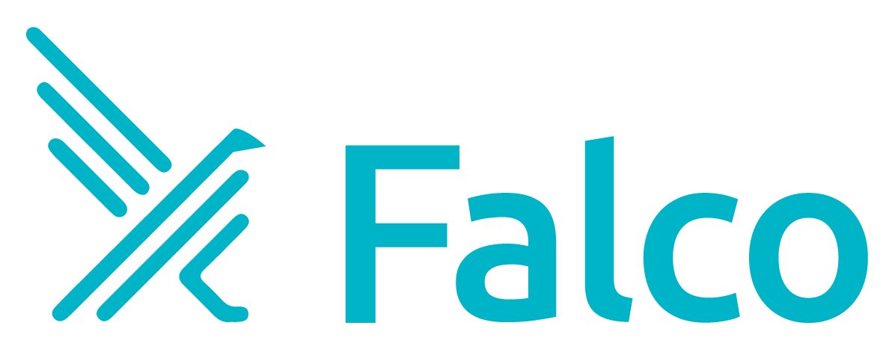

<p align="center"></p>
<p align="center"><b>Cloud Native Runtime Security.</b></p>

<hr>

# Falco Community 

The Falco community owns and maintains all aspects of The Falco Project. Every repository in the [falcosecurity](https://github.com/falcosecurity) GitHub org belongs to the community.


**Table of Contents**

- [Falco Community](#falco-community)
  - [Community Calls](#community-calls)
  - [Running a call](#running-a-call)
  - [Slack Channel](#slack-channel)
  - [Mailing List](#mailing-list)
  - [How to contribute](#how-to-contribute)
  - [Project Evolution](#project-evolution)

**Resources**

<!-- NAVIGATION_LINKS -->
 - [Governance](https://github.com/falcosecurity/evolution/blob/main/GOVERNANCE.md)
 - [Code Of Conduct](https://github.com/falcosecurity/evolution/blob/main/CODE_OF_CONDUCT.md)
 - [Maintainers Guidelines](https://github.com/falcosecurity/evolution/blob/main/MAINTAINERS_GUIDELINES.md)
 - [Maintainers List](https://github.com/falcosecurity/evolution/blob/main/MAINTAINERS.md)
 - [Repositories Guidelines](https://github.com/falcosecurity/evolution/blob/main/REPOSITORIES.md)
 - [Repositories List](https://github.com/falcosecurity/evolution/blob/main/README.md#repositories)
 - [Adopters List](https://github.com/falcosecurity/falco/blob/master/ADOPTERS.md)
 - [Contributing](https://github.com/falcosecurity/.github/blob/main/CONTRIBUTING.md)
 - [Security policy](https://github.com/falcosecurity/.github/blob/main/SECURITY.md)
 - [Join the Community](https://github.com/falcosecurity/community)
<!-- /NAVIGATION_LINKS -->

## Community Calls

These are the primary calls for The Falco Project. If you are unsure where to get started, this is the place to join.

**When**: [Biweekly Community Calls](https://lists.cncf.io/g/cncf-falco-dev/calendar), every 2 weeks on Wednesday at 4pm UTC.

You can see the Falco Calendar [here](https://lists.cncf.io/g/cncf-falco-dev/calendar) .

If you want to subscribe to the Falco calendar, you can use this ics feed.
```
https://lists.cncf.io/g/cncf-falco-dev/ics/7639482/1350118793/feed.ics
```

**Where**: [Zoom call](https://zoom.us/my/cncffalcoproject)

Falco Community calls gives the Falco community a common time to come together to discuss any open issues or PRs, new features, rules, upcoming releases, etc.

Each session is composed of 3 parts:

- Latest news of the project and its ecosystem
- A 5min lightning talk from anyone in the community, maintainers, contributors and users, about any topic they would like to present. It can be an existing feature, a POC for a new feature, a specific use case, a useful tip, etc.
- The remaining time is free for the users to ask for help to the present maintainers. Having created the issue on GitHub before will help.

The MC can be every community member willing to help run the call. The MC should be chosen in advance so that they have enough time to prepare the Agenda.

To give a lightning talk or discuss any topic in the upcoming meeting, please book the slot by adding an item in the [hackmd](https://hackmd.io/bDCYZ717QSWA1UBZXRSPfw#/).

After every release of Falco, the minutes of the community calls since the previous release are [published in this repository](https://github.com/falcosecurity/community/tree/master/meeting-notes).

**Minutes**: We use the same [hackmd](https://hackmd.io/bDCYZ717QSWA1UBZXRSPfw#/) document every week to track our minutes.

**History**: [Check out the YouTube channel](https://www.youtube.com/channel/UCd7LDOK1nN5jIULHk-LJJtA)

All of our calls are documented and posted to the [YouTube channel](https://www.youtube.com/channel/UCd7LDOK1nN5jIULHk-LJJtA). 

## Running a call

Regardless if you are interested in starting a new call, or running an existing call we have some structure in place to drive these calls.

 - All new calls should include a calendar invite sent to the mailing list's email address [cncf-falco-dev@lists.cncf.io](mailto:cncf-falco-dev@lists.cncf.io), as well as a short description of the call and the goals.
 - All calls should be recorded and published to the [Falco YouTube Channel](https://www.youtube.com/channel/UCd7LDOK1nN5jIULHk-LJJtA) 
    - _Note_: Please contact a maintainer for access to the channel if you need to upload a video. 
 - All calls should have written minutes using [hackmd.io](https://hackmd.io). Ideally the minutes are posted in advance to give collaborators a chance to add items before the meeting. After the meeting the notes should be closed, and uploaded to this repository.
     - _Note_: The template used for the Falco Community Calls can be [found here](meeting-note-template.md)
 - All calls must adhere to [the CNCF Code of Conduct](https://github.com/cncf/foundation/blob/master/code-of-conduct.md)

## Slack Channel

Join the **#falco** channel on [Kubernetes Slack](https://kubernetes.slack.com/messages/falco). We will be thrilled to meet you!

## Mailing List

Join the Falco [mailing list](https://lists.cncf.io/g/cncf-falco-dev) to keep you posted on important news and announcements.

## How to contribute

See the [contributing guide](https://github.com/falcosecurity/.github/blob/main/CONTRIBUTING.md) and the [code of conduct](https://github.com/falcosecurity/evolution/CODE_OF_CONDUCT.md).


## Project Evolution

The [falcosecurity/evolution](https://github.com/falcosecurity/evolution) repository is the official space for the community to work together, discuss ideas, and document processes. It is also a place to make decisions. Check it out to find more helpful resources.
